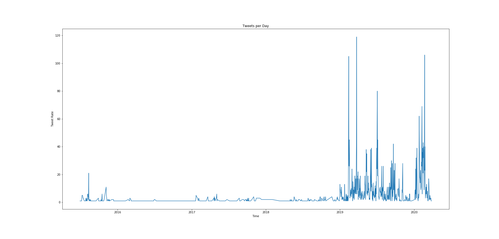

# Personal Data Examination

In 2018 California passed the CCPA (California Consumer Protection Act) which requires companies to provide consumers with a copy of the data that the company is storing about the consumer. In this project I requested my data from Facebook, Google, Apple, and Twitter and I took a look at what's there. I tell myself that the primary purpose of being on these platforms is to stay in touch with certain social groups. My goal is to examine the data and find out if that's true.

## The Data

Google quickly produced a 4.6GB mbox archive that contained 60,028 emails. We can import the entire library into python with just 2 lines of code. The sheer volume of this data makes it less appealing for a more in depth analysis.
```python
import mailbox
mbox = mailbox.mbox('data/Gmail/all_gmail.mbox')
```

Facebook delivered an archive that totaled 788.8mb and contained mostly JSON files along with a copy of every image I've ever uploaded. Examining the data reveals that the data is broken up into individual json files separated by subject. I loaded the json files into a mongoDB with a simple import for each of the files we're after.
```
$ mongoimport --db facebook --collection friends < friends.json
```
I decided I wanted to take a look at all of the messages, but each conversation is saved into its own separate json file. So I wrote a script that searches all the sub-directories and gathers all of the individual message files.
```python
import json
import os

directory_to_check = "data/facebook-owenmorris/messages/inbox/" #Parent directory to search from

all_msgs_arr = [] #store the json in this array

def find_message_json(directory):
    try:
        with open(os.getcwd()+'/message_1.json') as f:
            d = json.load(f)
            all_msgs_arr.append(d)
    except IOError:
        pass

# Get all the subdirectories of directory_to_check recursively and store them in a list:
directories = [os.path.abspath(x[0]) for x in os.walk(directory_to_check)]
directories.remove(os.path.abspath(directory_to_check)) # This line removes the parent directory

for i in directories:
    os.chdir(i)         # Change working Directory
    find_message_json(i)      # Run your function

all_msgs_df = pd.io.json.json_normalize(all_msgs_arr) # Use Pandas to normalize the json and store it on a DataFrame
```

Next up is Twitter. They delivered 269mb of javascript files. Upon further examination the files actually contain json objects that contain the data, and the only thing that makes the file javascript is the container declared at the beginning of the document.
```javascript
window.YTD.tweet.part0 = []
```
So I duplicated the documents I wanted, removed the javascript container statement, and renamed the file to '.json'. Then with one simple import statement I had my entire Tweet and DM history loaded up into python.
```python
tweets_df = pd.read_json('data/twitter/data/tweet.json')
#unpack the values from the individual entry into the wider DataFrame
tweets_df['full_text'] = tweets_df['tweet'].map(lambda x : x['full_text'])
tweets_df['favorite_count'] = tweets_df['tweet'].map(lambda x : x['favorite_count'])
tweets_df['retweet_count'] = tweets_df['tweet'].map(lambda x : x['retweet_count'])
tweets_df['created_at'] = tweets_df['tweet'].map(lambda x : pd.to_datetime(x['created_at']))
```

## The Exploration

I am curious what I can learn about myself from my information. So, Let's take a look at the frequency of my Twitter activity.

